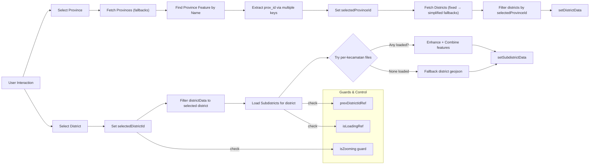

# App.tsx Architecture Guide

This document explains the design and flow of `src/App.tsx`, including its state, effects, map rendering, and the data-loading strategy for provinces, districts (kabupaten), and subdistricts (kecamatan).

## Overview

`App.tsx` builds an interactive Indonesia map using React and React-Leaflet. Users drill down from:
- Indonesia → Province → District → Subdistrict

The file contains:
- Shared helpers for robust JSON parsing and feature enrichment.
- A `MapController` component that manages selection state, data fetching, and layer updates.
- Multiple fetch fallbacks to locate GeoJSON files across different possible paths.

## Key Modules and Helpers

- `parseJsonSafely(response, context)`
  - Guards against HTML responses and malformed JSON.
  - Preserves error logging semantics used across loaders.

- `deriveKecamatanNameFromFileId(fileId)`
  - Converts file IDs like `id5102010_selemadeg_timur` → `Selemadeg Timur`.

- `enhanceKecamatanFeatures(features, kecamatanId, districtCode)`
  - Normalizes feature property variants for kecamatan name and district code.
  - Ensures downstream UI can consistently read names/ids regardless of source.

## State Model (selected excerpts)

- `selectedProvince: string | null`
- `selectedDistrict: string | null`
- `selectedDistrictId: string | number | null`
- `selectedProvinceId: string | number | null`
- `districtData: GeoJSONData | null`
- `subdistrictData: GeoJSONData | null`
- `isZooming: boolean`

Refs used to control effect loops and async behavior:
- `filteredForDistrictRef` to avoid re-filtering the same district twice.
- `prevDistrictIdRef` and `isLoadingRef` to prevent repeated subdistrict loads and race conditions.

## Effects and Data Flow

- Expose loader to window for cross-component triggers:
  - On mount: `window.appInstance.loadSubdistrictData = loadSubdistrictData`.

- Province selection → province ID
  - Fetch province GeoJSON (with fallbacks), find the selected province by name, then extract its ID via multiple property keys.
  - `setSelectedProvinceId(provId)`.

- Province ID → district list
  - Fetch districts GeoJSON (fixed → simplified fallbacks).
  - Filter features by `selectedProvinceId` via several possible property keys.
  - `setDistrictData(filtered)`.

- District selection → district filter
  - When `selectedDistrictId` changes, filter `districtData` to show only the selected district.

- District selection → subdistricts (kecamatan)
  - Loaders for specific districts (e.g., Tabanan, Jembrana, Banyuwangi) attempt to fetch multiple kecamatan files one by one.
  - Fallback to a single district-level GeoJSON if no per-kecamatan files loaded.
  - Combined features are enriched via `enhanceKecamatanFeatures` and stored in `subdistrictData`.

## Data Loading Strategy (fallbacks)

Each loader uses the same pattern:
1. Try canonical path under `/data/...`.
2. Fallbacks under alternative roots, e.g.:
   - `/indonesia-district-master 3/...`
   - `/id51_bali/...`
   - `/geojsonKecamatan/...`
3. If a kecamatan file fails, continue to the next; if none load, fallback to a district file with similar path fallbacks.

Parsing is performed with HTML guards to avoid treating error pages as JSON.

## Map Rendering (high level)

- `MapContainer` + `TileLayer` render the base map.
- `GeoJSON` layers switch based on current drilldown:
  - Province boundaries → District boundaries (filtered by selected province) → Subdistrict geometries.
- Breadcrumb UI and click handlers update the selection state and trigger the above effects.

## Mermaid Diagram

## Notable Design Choices

- Multiple property key handling (e.g., `prov_name` vs. `PROVINSI` vs. `NAMA`) to accommodate heterogeneous data sources.
- Defensive parsing to avoid HTML/error pages poisoning JSON flows.
- Ref-based guards to prevent infinite loops and re-entrant loads.
- Behavior-preserving helpers centralize normalization while minimizing risk.

## Extension Points

- Introduce a generic `fetchWithFallback(urls[])` helper to remove repetitive try/catch blocks.
- Move loaders to `src/loaders/` modules and import into `App.tsx` for clarity.
- Add memoization/caching of fetched GeoJSON to avoid re-downloading on repeated navigation.
- Consider topology simplification or server-side tiling for very large geometries.

## Related Files

- `src/App.tsx` — main app and map controller logic
- `src/App.css` — styles
- Data roots referenced during fetch fallbacks:
  - `public/data/`, `geojsonKecamatan/`, `id51_bali/`, `indonesia-district-master 3/`
